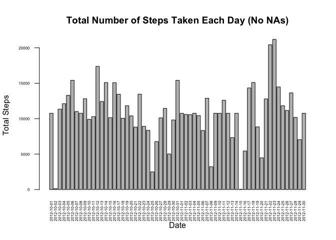
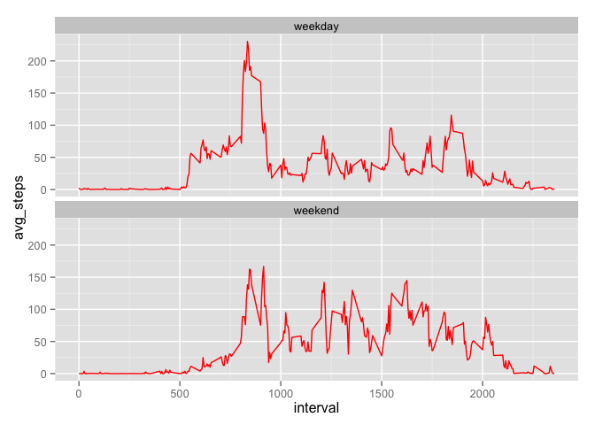

# Reproducible Research: Peer Assessment 1


```r
# Redefining inline so will print numbers normally and not in with exponent notation
knitr::knit_hooks$set(inline = function(x) {
  knitr:::format_sci(x, 'md')
})
```

## Loading and preprocessing the data
The data is provided in a zip file, so unzip it and read the csv file


```r
unzip("activity.zip")
activity <- read.csv("activity.csv")

# Build a matrix containing only rows with no NAs
activity_no_na <- activity[rowSums(is.na(activity)) == 0,] 
```

## What is mean total number of steps taken per day?
For this part, I ignore the missing valus in the set
I calculate the total steps for each day and then I build a histogram of those values.


```r
total_steps <- tapply(activity$steps, activity$date, FUN = sum, na.rm=TRUE)
hist(total_steps, main = "Histogran of Total Steps", xlab = "Number of steps", 
     ylab = "Number of days");
```

 


```r
mean_steps <- mean(total_steps)
median_steps <- median(total_steps)
```

The mean number of steps taken per day is 9354.2295  
The median number of steps taken per day is 10395

## What is the average daily activity pattern?

```r
avg_steps_interval <- tapply(activity$steps, activity$interval, FUN = mean, na.rm=TRUE)
plot(names(avg_steps_interval), avg_steps_interval, type = "l", 
     ylab = "Avg Steps", xlab = "Interval", main = "Average Steps Taken Avergaed Across all Days")
```

 


```r
pos_max_interval = which.max(avg_steps_interval)
max_interval = avg_steps_interval[pos_max_interval]
```

The maximum number of avergae steps is at the 104 5-minute interval and its value is 206.1698.

## Imputing missing values


```r
row_has_na <- apply(activity, 1, function(x){any(is.na(x))})
total_rows_with_na <- sum(row_has_na)
```

There are 2304 rows with NA in them.

I am going to fill the missing values with the mean of the 5-minute interval which it belongs to, which was calculated before.


```r
# Fill that in the places where there are NAs
activity_no_na <- activity
activity_no_na[is.na(activity[,"steps"]), "steps"] <- avg_steps_interval[as.character(activity_no_na[is.na(activity[,"steps"]), "interval"])]
```

Let's have a new histogram and calculate the new mean and median for the total number of steps taken per day


```r
new_total_steps <- tapply(activity_no_na$steps, activity_no_na$date, FUN = sum)
hist(total_steps, main = "Histogran of Total Steps (No NAs)", xlab = "Number of steps", 
     ylab = "Number of days");
```

 


```r
new_mean_steps <- mean(new_total_steps)
new_median_steps <- median(new_total_steps)
```

The mean number of steps taken per day (no NAs) is 10766.1886792453  
The median number of steps taken per day (no NAs) is 10766.1886792453

We can see that the values differ from the first part of the assignment.  
The impact of imputing missing data on the estimates of the total daily number of steps, with the method that I chose, caused the number of steps to increase per day.

## Are there differences in activity patterns between weekdays and weekends?


```r
library(datasets)
library(ggplot2)
library(reshape2)
activity_no_na$daytype <- ifelse(weekdays(as.Date(activity_no_na$date)) %in% c("Saturday", "Sunday"), 
        "weekend", "weekday")
activity_no_na <- transform(activity_no_na, daytype = factor(daytype))
avg_steps_interval <- tapply(activity_no_na$steps, 
                             list(activity_no_na$interval, activity_no_na$daytype), FUN = mean)
avg_steps_interval_melt <- melt(avg_steps_interval, measure.vars=c("weekend","weekday"))
names(avg_steps_interval_melt) <- c('interval', 'daytype', 'avg_steps');
ggplot(avg_steps_interval_melt, aes(interval, avg_steps)) +
        geom_line(color="red") +
        facet_wrap(~daytype, nrow=2)
```

 
